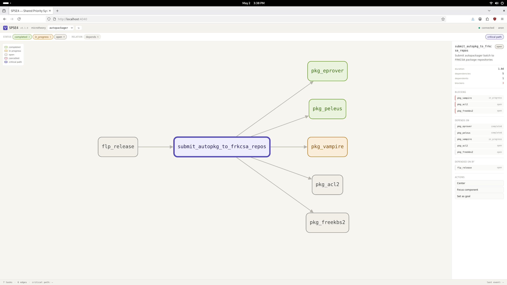

# SPSE4 — Shared Priority System Editor

A multi-relation, microtheory-rooted, graph-based planning-domain editor for
SWI-Prolog. SPSE4 is the successor to [SPSE2](https://frdcsa.org/visual-aid/pdf/Temporal-Planning-and-Inferencing-for-Personal-Task-Management-with-SPSE2.pdf)
(2011, Perl/Tk) and SPSE2-Formalog (the SWI-Prolog bridge). It consolidates
the task ontology, temporal reasoning, planning-language I/O, scheduling, and
reactive execution into a single process with a single data model, rooted in
microtheories rather than UniLang round-trips.

SPSE4 is part of the [FRDCSA](https://frdcsa.org/) (Formalized Research
Database: Cluster, Study and Apply) project.



*v0.1.29 — the SPSE4 web client rendering the FRDCSA Autopackager task queue
as a directed graph, with the critical path to "submit autopackager to FRKCSA project repos" highlighted.*

---

## Status

- **v0.1**: feature-complete. Five Prolog packs, ~3,900 lines, 79 PlUnit tests.
- **v0.1.29**: server trio first leg shipped. `pack-spse4-server` (Pengines +
  WebSocket transport + basic auth + per-microtheory ACL) and `spse4-web`
  (Cytoscape.js client) both functional.
- **v0.2.0**: collaboration layer end-to-end. Add/delete task UI in
  `spse4-web`, REST mutation endpoints (`POST /tasks`,
  `DELETE /tasks/<mt>/<id>`), and broadcast wiring in `pack-spse4-core` so
  a task created in one browser tab appears in another within one poll
  cycle. Adds 15 new PlUnit tests. Also fixes a latent v0.1 bug in
  `task_retract/2`'s edge-property cleanup.
- **v0.2.x in flight**: WebSocket push (replacing the 3-second poll),
  `spse4-mode.el` Emacs mode using `pengine.el`, multi-instance
  broadcast demo recording.

See `CHANGES.md` for the per-version changelog.

---

## What SPSE4 is for

- Editing planning domains as **multi-relation graphs** rather than text
  files. Tasks, temporal intervals, dependencies, attack/support arguments,
  and arbitrary user-defined relations all coexist in the same graph.
- Reasoning about plans with **Allen interval algebra** and CLP(FD)
  scheduling.
- Importing and emitting **PDDL2.2** for interoperability with classical and
  temporal planners.
- Persisting domain knowledge in **microtheories** so multiple incompatible
  worlds can coexist in one store.
- Driving downstream tools through **reactive triggers** broadcast over a
  Pengines + WebSocket bus.

The system is designed for use as the planning layer of the
[Free Life Planner (FLP)](https://freelifeplanner.org/doc), and equally as a
general-purpose planning-domain editor for AI-planning research.

---

## Architecture

Five composable SWI-Prolog packs in three layers:

```
                pack-spse4-scheduler   (datetimes, critical path, reactive triggers)
                          ↓
                pack-spse4-core        (task ontology, edges, projections, SPSE2 import)
                          ↓
       pack-mt-store     pack-allen     pack-pddl
       (microtheories)   (interval alg.) (PDDL2.2 I/O)
```

Plus the v0.1.29 server trio:

```
                spse4-web              (Cytoscape.js browser client)
                          ↓ WebSocket / HTTP
                pack-spse4-server      (Pengines + auth + per-mt ACL)
                          ↓
                pack-spse4-{core,scheduler}
```

The **foundation packs** (`pack-allen`, `pack-mt-store`, `pack-pddl`) have no
SPSE4-specific dependencies and are independently useful to anyone doing
temporal reasoning, microtheory-based KR, or PDDL I/O in SWI-Prolog.

All packs follow Covington and Bratko's Prolog coding conventions: `:- module/2`
on every file, PlDoc docstrings on every exported predicate, PlUnit tests
colocated in `t/`, strings for all user-visible text, atoms for identifiers
and enumerated values.

---

## Install

### Prerequisites

- SWI-Prolog 9.0 or newer
- A modern web browser (for `spse4-web`)

### From a release tarball

```sh
tar xzf spse4-v0.1.29.tar.gz
cd spse4-v0.1.29
swipl -g "pack_install('pack-allen',          [interactive(false)])" -t halt
swipl -g "pack_install('pack-mt-store',       [interactive(false)])" -t halt
swipl -g "pack_install('pack-pddl',           [interactive(false)])" -t halt
swipl -g "pack_install('pack-spse4-core',     [interactive(false)])" -t halt
swipl -g "pack_install('pack-spse4-scheduler',[interactive(false)])" -t halt
swipl -g "pack_install('pack-spse4-server',   [interactive(false)])" -t halt
```

### From the repository

```sh
git clone https://github.com/aindilis/spse4.git
cd spse4
swipl run_all_tests.pl   # should report 79 tests passing
```

---

## Quickstart: the autopackager demo

The `server_demo.pl` example seeds the SPSE4 store with the FRDCSA
Autopackager task queue, starts the Pengines server, and serves the
Cytoscape.js client.

```sh
cd spse4
swipl pack-spse4-server/examples/server_demo.pl
```

Then open <http://localhost:4040/> in a browser. You should see the task
graph rendered, with the critical path to "submit autopackager to FRKCSA project repos" highlighted.

---

## Documentation

- `docs/spse4.pdf` — full system description and design rationale (13 pages).
- `docs/spse4.tex` — LaTeX source.
- `docs/spse4.org` — Org-mode source (the canonical source; LaTeX is exported
  from this).
- `docs/build.sh` — builds the PDF (`./build.sh` for direct pdflatex, or
  `./build.sh --via-org` to round-trip through Emacs Org export).
- `CHANGES.md` — per-tarball changelog from v0.1.0 through v0.1.29.

---

## Related FRDCSA components

- **Free Life Planner (FLP)** — the personal life-planning application that
  SPSE4 serves as the planning layer for.
- **Autopackager** — the Debian-package autogeneration system whose task
  queue is the demo domain shown in the screenshot above.
- **SPSE2** — the 2011 Perl/Tk predecessor.

---

## Citation

If you use SPSE4 in academic work, please cite:

> Dougherty, A. (2026). *SPSE4: A Multi-Relation Graph-Based Planning-Domain
> Editor for SWI-Prolog.* FRDCSA Project Technical Report.

A BibTeX entry is in `docs/spse4.bib`.

---

## License

GNU General Public License v3.0 or later (GPL-3.0-or-later). See
`LICENSE` for the full text.

This matches the licensing of the wider FRDCSA project and reflects the
project's commitment to Free Software philosophy: derivative works that run
SPSE4 as a network service must remain free.

---

## Acknowledgements

- The SPSE4 v0.1 design and implementation was a collaboration between
  Andrew Dougherty (`aindilis`) and Anthropic's Claude Opus 4.7 over April
  2026.
- SPSE2 (2011) is the conceptual ancestor, and many of its design choices
  carry forward.
- The `pack-allen` Allen interval algebra is implemented per Allen (1983);
  the CLP(FD) scheduler uses SWI-Prolog's `library(clpfd)`.
- The Pengines transport is built on Jan Wielemaker's `library(pengines)`.

---

## Contact

Andrew Dougherty — <adougher9@yahoo.com> — [FRDCSA](https://frdcsa.org/)
